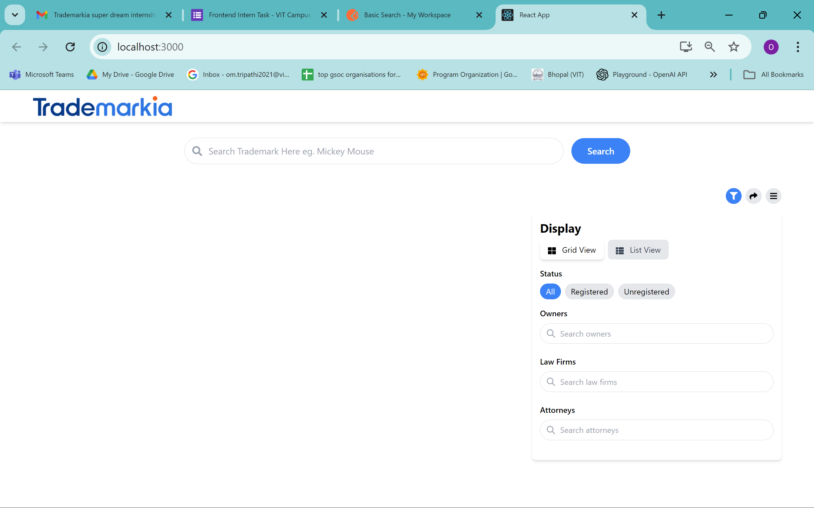
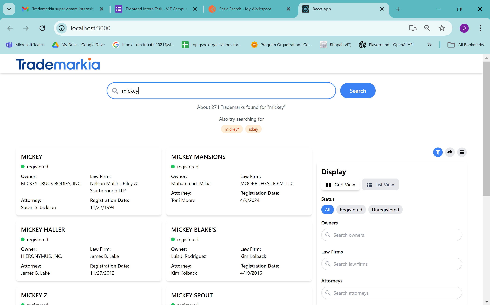
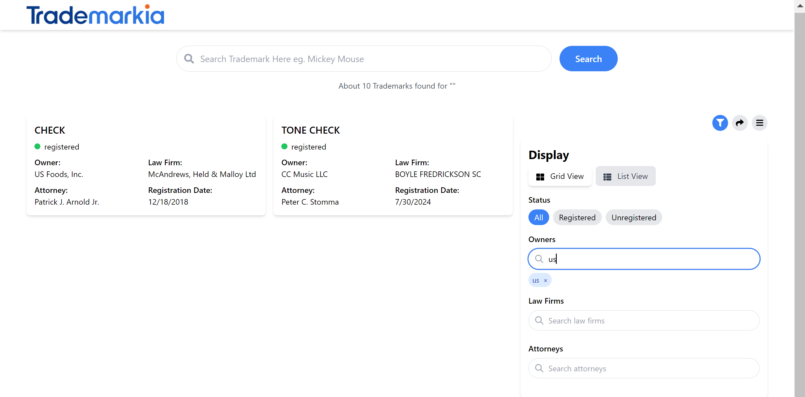

# Trademarkia Frontend Task - 21BCE11630

## Project Screenshot

## Landing Page

## Searching

## Filter

In the project directory, you can run:

### `npm start`

Runs the app in the development mode.\
Open [http://localhost:3000](http://localhost:3000) to view it in your browser.

